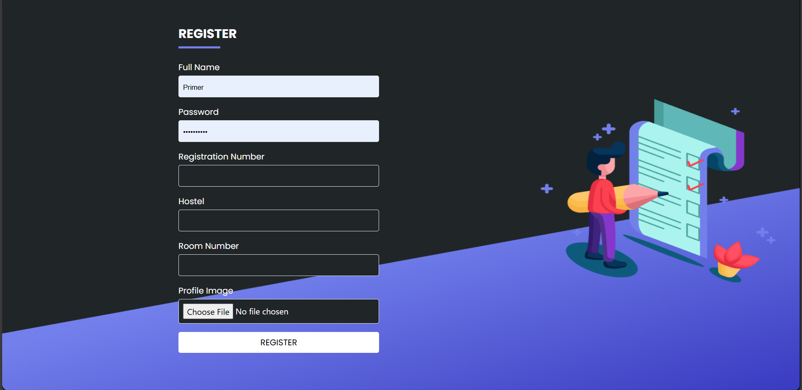
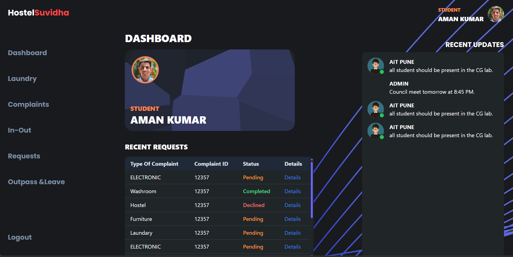
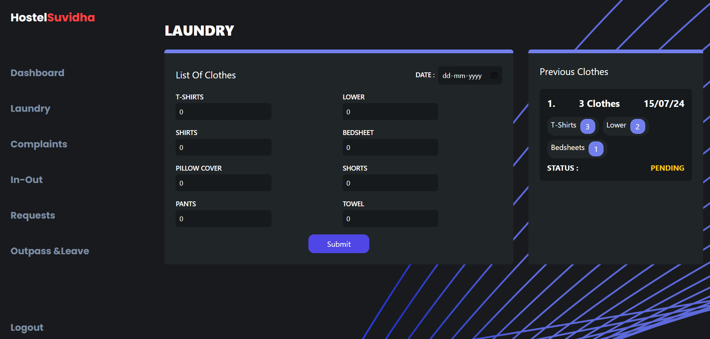
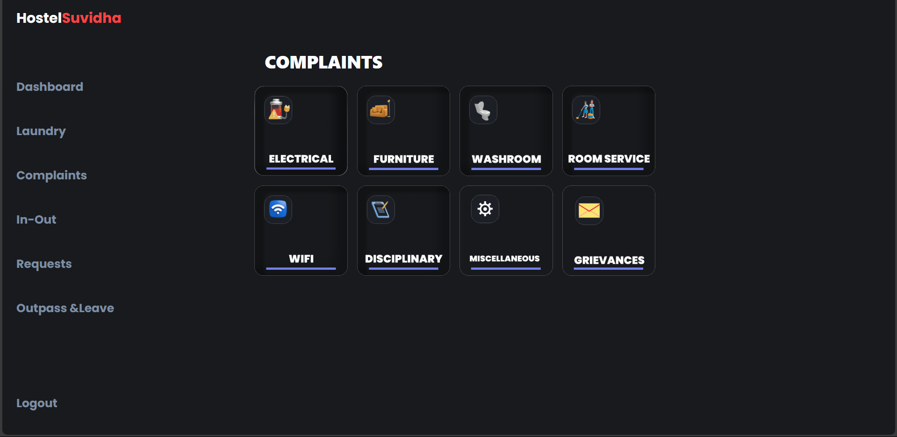
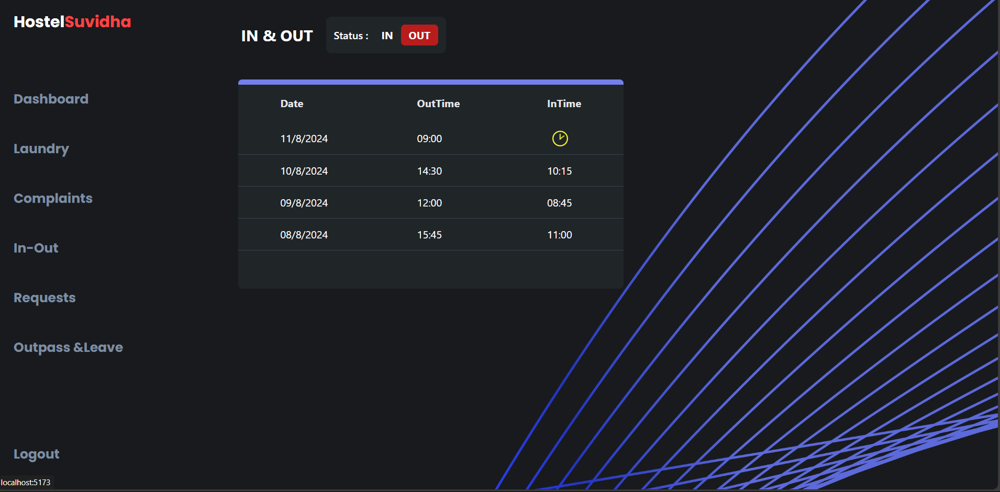
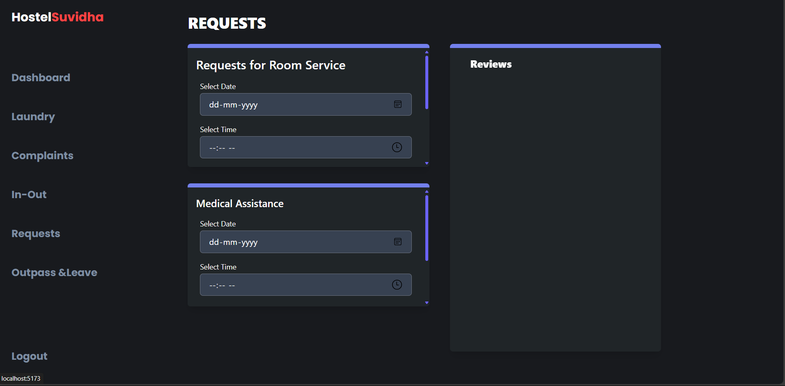
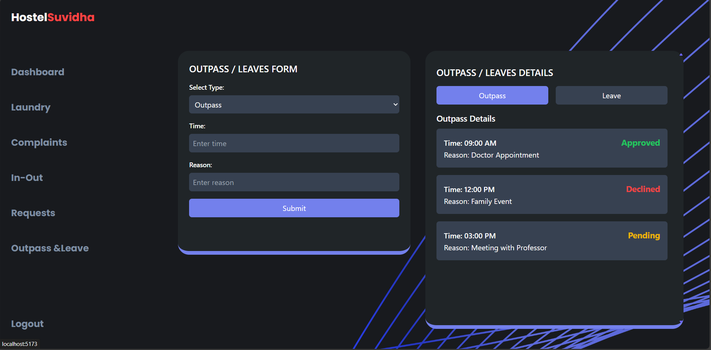

<!DOCTYPE html>
<html lang="en">
<head>
  <meta charset="UTF-8" />
  <meta name="viewport" content="width=device-width, initial-scale=1.0"/>
  <title>HostelSuvidha - README</title>
  
</head>
<body>

  <h1>🏨 HostelSuvidha</h1>
  

    HostelSuvidha is a modern, intuitive web-based platform designed to streamline hostel-related services for students and administrators.
  

  <h2>🚀 Features</h2>
  <ul>
    <li>Student and Admin login interface</li>
    <li>Room availability and allocation</li>
    <li>Complaint and maintenance tracking</li>
    <li>Leave application system</li>
    <li>Responsive design with easy navigation</li>
  </ul>

  <h2>🛠️ Tech Stack</h2>
  <ul>
    <li>HTML, CSS, JavaScript</li>
    <li>MongoDB (for database)</li>
    <li>Node.js & Express.js (for backend)</li>
  </ul>

  <h2>📦 Installation</h2>
  <ol>
    <li>Clone the repository:
      <pre><code>git clone https://github.com/your-username/hostelsuvidha.git</code></pre>
    </li>
    <li>Navigate into the folder:
      <pre><code>cd hostelsuvidha</code></pre>
    </li>
    <li>Install dependencies:
      <pre><code>npm install</code></pre>
    </li>
    <li>Run the server:
      <pre><code>npm start</code></pre>
    </li>
  </ol>

  <h2>🖥️ Screenshots</h2>

  
  
  
  
  
  
  

  <h2>👨‍💻 Author</h2>
  
Ramkishan Gupta

  <h2>📄 License</h2>
  
This project is licensed under the <strong>MIT License</strong>.

</body>
</html>
